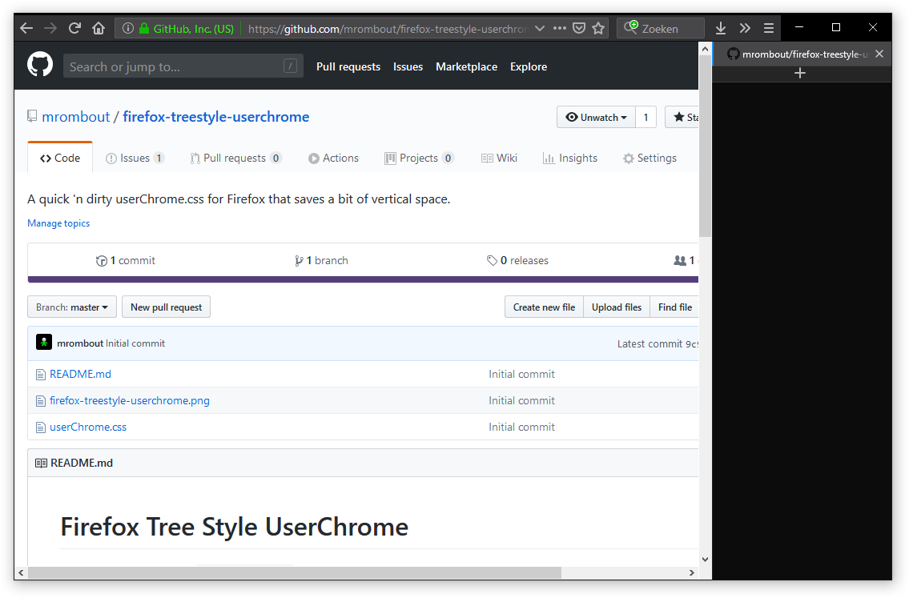

# Firefox Tree Style UserChrome

This is a quick and dirty `userChrome.css` for Firefox that I use on Windows 10 machines.
It is a bit of scraped together CSS for which I will, at some time in the future, credit the original authors.

## How to use?

> Note that the `userChrome.css` might need some tweaking for **your** system.

1. See https://www.userchrome.org/ on how to install this `userChrome.css`.
2. Install https://addons.mozilla.org/en-US/firefox/addon/tree-style-tab/
3. ???
4. Profit!